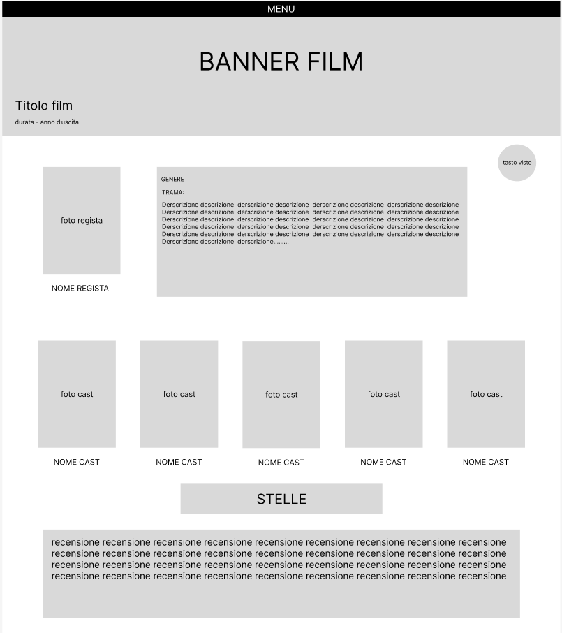

# SpugnaTV

PROBLEMA
Ho una pessima memoria, non riesco a tenere traccia dei film/serie che sono usciti, che ho visto, che devo vedere e della mia opinione su di essi.

DESCRIZIONE
Webapp per tenere traccia di serie/film usciti (clone di TvTime). App che contiene tutte le informazioni sui i film usciti (regista, attori, dove vederli ecc..) con la possibilita di contrassegnare i film visti e di lasciare la propria recensione

FUNZIONALITÀ
- registrazione utente
- autenticazione utente
- recupero password
- modifica utente
- elimina utente
- visualizzazione statistiche utente
- inserimento film
- inserimento regista
- inserimento attore
- ricerca per nome/regista
- funzione sfoglia dal catalogo di film
- visualizzazione delle informazioni di un film
- visualizzazione delle informazioni di un regista
- creazione di una lista personalizzata
- modifica lista personalizzata
- eliminazione lista personalizzata
- inserimento/rimozione di un film da una lista personalizzata
- contrassegnamento di un film come visto
- visulizzazione delle liste di un utente
- inserimento di una valutazione personale in stelle
- inserimento di una valutazione personale come commento
- funzione che estrae un film random tra quelli da vedere

MODELLO ER

SCHEMA RELAZIONALE

- Utenti (email*, username, password, foto_profilo, ruolo)
- Liste(id*, nome, utente_email)
- Film (id*, titolo, Anno, durata, genere, trama, locandina, banner) Attori (id, nome, cognome, foto)
- Registi(id*, nome, cognome, data_nascita, data_morte, descrizione, foto)
- Recensioni(id*, n_stelle, commento, utente_email, film_id)
- Comprende (lista id*, film id*)
- Recita (attore id*, film id*)
- Dirige (regista id*, film id*)

MOCKUP

schermata di login

schermata di registrazione

schermata registrazione film

schermata registrazione regista

schermata registrazione cast

schermata registrazione recensione

schermata ricerca

visualizzazione di una lista

visualizzazione scheda di un regista

visualizzazione scheda di un film

visualizzazione profilo utente

ISTRUZIONI
- eseguire il comando:
    docker run --name myXampp -p 41061:22 -p 41062:80 -d -v /workspaces/SpugnaTV:/www tomsik68/xampp:8
- aprire l'indirizzo del docker nel browser
- aprire phpmyadmin e creare il databese eseguendo il file db.sql
- digitare /www alla fine dell url

N.B.
per avere accesso alle funzioni da amministratore accedere come
email: gabrisonzo@gmail.com
pswd: admin
