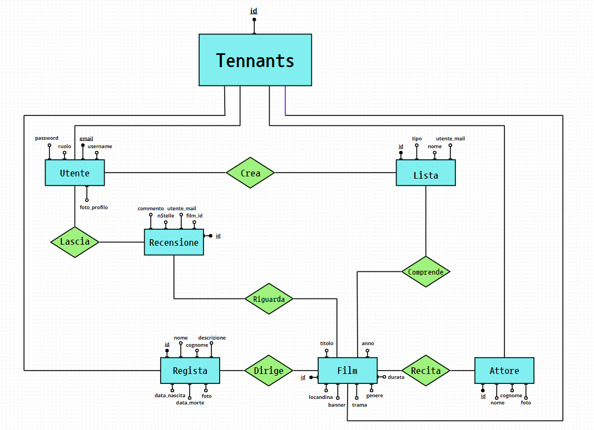

# SpugnaTV

PROBLEMA
Ho una pessima memoria, non riesco a tenere traccia dei film/serie che sono usciti, che ho visto, che devo vedere e della mia opinione su di essi.

DESCRIZIONE
Webapp per tenere traccia di serie/film usciti (clone di TvTime). App che contiene tutte le informazioni sui i film usciti (regista, attori, dove vederli ecc..) con la possibilita di contrassegnare i film visti e di lasciare la propria recensione

FUNZIONALITÀ
- registrazione utente
- autenticazione utente
- recupero password
- modifica utente
- elimina utente
- visualizzazione statistiche utente
- inserimento film
- inserimento regista
- inserimento attore
- ricerca per nome/regista
- funzione sfoglia dal catalogo di film
- visualizzazione delle informazioni di un film
- visualizzazione delle informazioni di un regista
- creazione di una lista personalizzata
- modifica lista personalizzata
- eliminazione lista personalizzata
- inserimento/rimozione di un film da una lista personalizzata
- contrassegnamento di un film come visto
- visulizzazione delle liste di un utente
- inserimento di una valutazione personale in stelle
- inserimento di una valutazione personale come commento
- funzione che estrae un film random tra quelli da vedere

MODELLO ER

SCHEMA RELAZIONALE

- Utente (email*, username, password, foto_profilo)
- Lista(id*, nome, utente_email)
- Film (id*, titolo, Anno, durata, genere, trama, locandina, banner) Attori (id, nome, cognome, foto)
- Registi(id*, nome, cognome, data_nascita, data_morte, descrizione, foto)
- Recensioni(id*, n_stelle, commento, utente_email, film_id)
- Comprende (lista id*, film id*)
- Recita (attore id*, film id*)
- Dirige (regista id*, film id*)

MODELLO FISICO

CREATE DATABASE IF NOT EXISTS spugnaTV;
USE spugnaTV;

CREATE TABLE IF NOT EXISTS Utente(
    email VARCHAR(255) PRIMARY KEY,
    username VARCHAR(255) NOT NULL,
    password VARCHAR(255) NOT NULL,
    foto_profilo VARCHAR(255)
);

CREATE TABLE IF NOT EXISTS Lista(
    id SERIAL PRIMARY KEY,
    nome VARCHAR(255) NOT NULL,
    utente_mail VARCHAR(255) REFERENCES Utente(email) ON DELETE CASCADE
);

CREATE TABLE IF NOT EXISTS Film(
    id SERIAL PRIMARY KEY,
    titolo VARCHAR(255) NOT NULL,
    anno INT NOT NULL,
    durata INT NOT NULL,
    genere VARCHAR(255),
    trama VARCHAR(1000),
    locandina VARCHAR(255),  
    banner VARCHAR(255)
);

CREATE TABLE IF NOT EXISTS Attori(
    id SERIAL PRIMARY KEY,
    nome VARCHAR(255) NOT NULL,
    cognome VARCHAR(255) NOT NULL,
    foto VARCHAR(255) NOT NULL
);

CREATE TABLE IF NOT EXISTS Registi(
    id SERIAL PRIMARY KEY,
    nome VARCHAR(255) NOT NULL,
    cognome VARCHAR(255) NOT NULL,
    data_nascita DATE NOT NULL,
    data_morte DATE,
    desccrizione VARCHAR(1000),
    foto VARCHAR(255) NOT NULL  
);

CREATE TABLE IF NOT EXISTS Recensioni(
    id SERIAL PRIMARY KEY,
    nStelle INT NOT NULL,
    commento VARCHAR(1000),
    utente_mail VARCHAR(255) REFERENCES Utente(email) ON DELETE CASCADE,
    film_id INT REFERENCES Film(id) ON DELETE CASCADE
);

CREATE TABLE IF NOT EXISTS Comprende(
    lista_id INT REFERENCES Lista(id) ON DELETE CASCADE,
    film_id INT REFERENCES Film(id) ON DELETE CASCADE,
    PRIMARY KEY (lista_id, film_id)
);

CREATE TABLE IF NOT EXISTS Recita(
    film_id INT REFERENCES Film(id) ON DELETE CASCADE,
    attori_id INT REFERENCES Attori(id) ON DELETE CASCADE,
    PRIMARY KEY (film_id, attori_id)
);

CREATE TABLE IF NOT EXISTS Dirige(
    film_id INT REFERENCES Film(id) ON DELETE CASCADE,
    registi_id INT REFERENCES Registi(id) ON DELETE CASCADE,
    PRIMARY KEY (film_id, registi_id)
);

MOCKUP

schermata di login

schermata di registrazione

schermata registrazione film

schermata registrazione regista

schermata registrazione cast

schermata registrazione recensione

schermata ricerca

visualizzazione di una lista

visualizzazione scheda di un regista

visualizzazione scheda di un film

visualizzazione profilo utente

